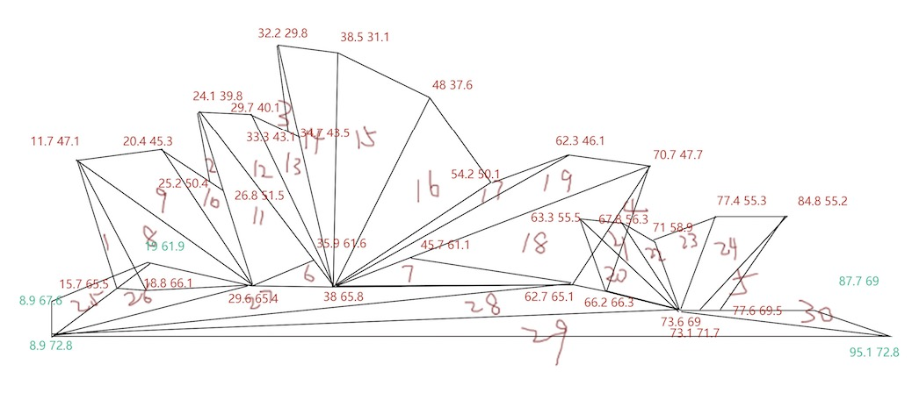
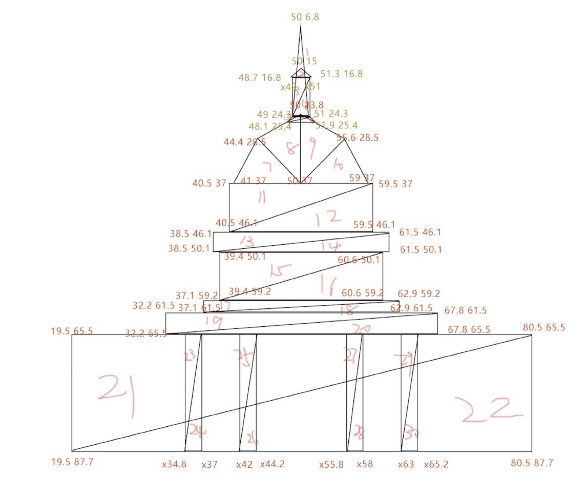
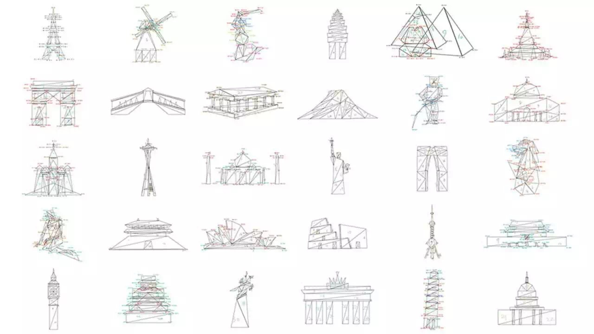
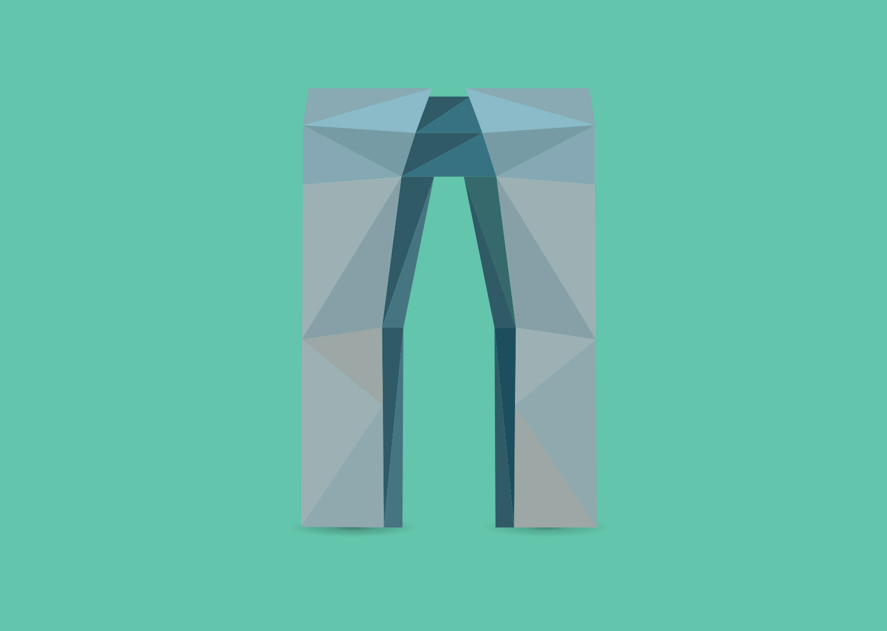
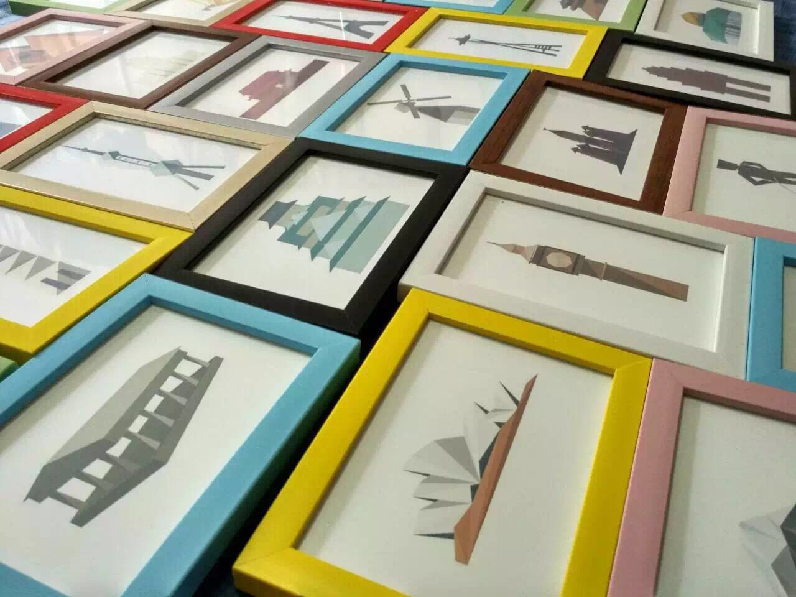

# 卅 - 地标图形设计  

## 说明  

+ 预览：[卅-地标图形设计 戳此预览](https://vsme.github.io/SA-css3/)  
+ 原网址：[species-in-pieces](http://www.species-in-pieces.com/)  
+ 这是一份设计作业，顺带改的一个网站。
+ 完成时间2016年初，而且改的乱七八糟的。
+ 网站非原创！网站非原创！网站非原创！重要的事情说三遍。  

## 制作过程

#### 一、 扒站（嗯，你没有看错！）  
#### 二、 过程图  

  <b>纯css3的`clip-path:polygon...` 懂的人自然懂～ 哈哈哈</b>
    
  

#### 三、 设计稿  

  <b>线稿</b>
    
  
    
  
    
  
    
  <b>成品</b>
    
  悉尼歌剧院
    
  
    
  东方之门 - 大裤衩
    
  
    
  还有相框
    
  

# 最后  

对原作者有冒犯之处，还请多多指正。  